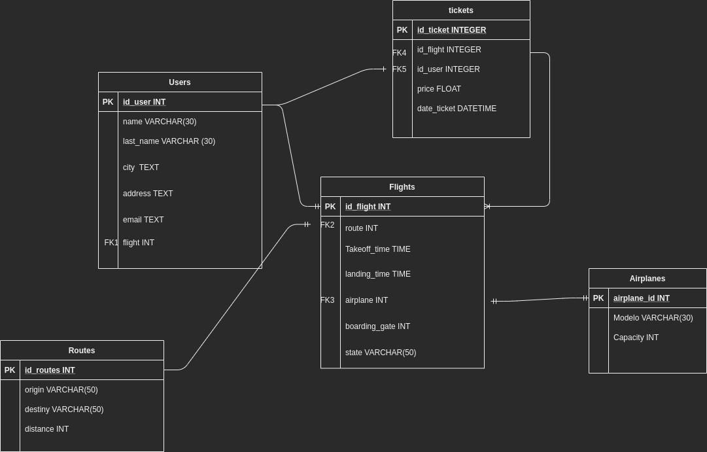

## Master X Day - BACKEND

Instructions:

1. Fork the project
2. Make your changes for each stage
3. Make a Pull Request
4. In url link eg. "https://github.com/PlatziMaster/Master-X-Day-Backend/compare/main...rafalagunas:main" you have to concatenate
   "?template=phase1.md" so your url looks like this => "https://github.com/PlatziMaster/Master-X-Day-Backend/compare/main...rafalagunas:main?template=phase1.md"
5. Create the pull request

# First stage

1. Image of database structure:



2. SQL script added

To run:

```

// Run database
docker run --rm --name plmysql -e MYSQL_ROOT_PASSWORD=secret -p 3306:3306 -d mysql

```

Copy the .sql file, run a bash in the container and run
```
// Run the script
source creatablas.sql

```

3. Template of Flask and template of request

# 3rd and 4th stage

# Run

Run container:
docker run --rm --name plmysql -e MYSQL_ROOT_PASSWORD=secret -p 3306:3306 -d mysql
docker cp creatablas.sql plmysql:/creatablas.sql

Enter into mysql:
docker exec -it plmysql /bin/bash

Access to database:
mysql -u root -p
Login with the password: secret

Create database aeroplatzi:
create database aeroplatzi;
use aeroplatzi;
source creatablas.sql

Run python scritp:
python3 main.py


## Endpoints 

/search_flight returns the amount of total flights
/create_flight  creates a flight
